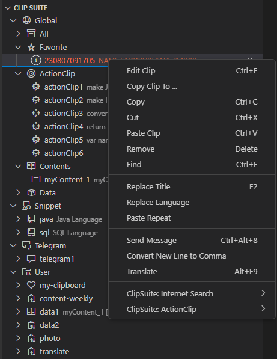

# Clip Suite for Visual Studio Code

[](https://marketplace.visualstudio.com/items?itemName=utocode.clipsuite)
[](https://marketplace.visualstudio.com/items?itemName=utocode.clipsuite)
[](https://github.com/utocode/jenkins-suite/blob/master/LICENSE)

Are you tired of juggling between various extensions to streamline your coding workflow? Look no further! We are thrilled to present ClipSuite, the all-in-one solution crafted to enhance your Visual Studio Code experience like never before. With a suite of powerful features meticulously designed to turbocharge your productivity, ClipSuite is set to become your new coding companion.


## Features



### Multiple Clipboards

Say goodbye to the limitations of a single clipboard. With ClipSuite, you can work with multiple clipboards, making copy-paste tasks across various sections of your project a breeze.

### ActionClip: Simple String Operations (JavaScript)

Simplify string manipulations with ClipSuite's built-in string operations. Transform, format, and manipulate text effortlessly, saving you valuable time on repetitive tasks.

### Send clipboards, images, and files via Telegram

Collaborate seamlessly with your teammates using clipboard telegrams. Send and receive code snippets through the clipboard in real-time, making code sharing and collaboration a breeze.

### Effortless Snippet Support

Never reinvent the wheel again. ClipSuite seamlessly integrates snippet support, allowing you to insert predefined code snippets and templates with ease.

### Effortless Clipboard Synchronization via GitHub

GitHub integration lets you store your ClipSuite clipboards and access them from anywhere, ensuring a seamless continuation of your work. With your clipboards securely hosted on GitHub, you can effortlessly pick up where you left off, whether you're switching between devices or collaborating with teammates. This integration not only enhances your productivity but also provides a reliable way to manage and share your clipboards, snippets, and files across different environments


## Installation

Follow these steps to set up ClipSuite and start boosting your productivity:

1. Open Visual Studio Code.
2. Go to the Extensions view by clicking on the Extensions icon in the Activity Bar on the side of the window, or use the shortcut `Ctrl+Shift+X`.
3. Search for "ClipSuite" in the Extensions view search bar.
4. Click the "Install" button next to the ClipSuite extension.
5. Once the installation is complete, you're all set! Enjoy the enhanced coding experience.

## Usage

- **Multiple Clipboards:** Use the new clipboard icons in the editor's toolbar to manage multiple clipboards. You can copy, cut, and paste from different clipboards effortlessly.

- **Snippets:** Trigger snippets using predefined shortcuts or access them through the editor's context menu.

- **Send clipboards via Telegrams:** Use the clipboard telegrams feature to collaborate with your teammates. Just copy the code snippet and send it like a telegram!

- **String Operations:** Find the string operations under the context menu when you right-click on a selected text. Choose the operation you want to apply.

## Configurations

> To configure the multiple clipboards feature, you can add entries to your Visual Studio Code settings (settings.json).
Here's an example configuration:

```json
  "clipsuite.clips": {
    "MyClipboard": {
      "name": "MyClipboard",
      "filepath": "c:\\GitHubHome\\myClipboard.json",
      "mac": {
        "filepath": "/Users/{YOUR_ACCOUNT}/workspace/myclips/myClipboard.json",
      },
      "description": "My Clipboard"
    },
    "Mycontent": {
      "name": "Mycontent",
      "filepath": "c:\\GitHubHome\\mycontent.json",
      "description": "My content Clipboard",
      "mac": {
        "filepath": "/Users/{YOUR_ACCOUNT}/workspace/myclips/mycontent.json",
      },
      "template": "myContent_1"
    }
  }
```

> Clipboard Synchronization via GitHub

```json
  "clipsuite.gitConfig": {
    "gitHub": {
      "repoPath": "git@github.com:{YOUR_ACCOUNT}/clip-repo.git",
      "localHome": "c:\\GitHubHome",
      "token": "__YOUR_TOKEN__",
      "userName": {"YOUR_ACCOUNT}_win",
      "userEmail": "{YOUR_ACCOUNT}@gmail.com",
      "intervalSyncTime": 25,
      "mac": {
        "localHome": "/Users/{YOUR_ACCOUNT}/workspace/myclips",
        "userName": {"YOUR_ACCOUNT}_mac",
        "intervalSyncTime": 20
      }
    },
    "gitHub-file": {
      "repoPath": "git@github.com:{YOUR_ACCOUNT}/clip-file-repo.git",
      "localHome": "c:\\GitHubFile",
      "token": "__YOUR_TOKEN__",
      "userName": {"YOUR_ACCOUNT}_win",
      "userEmail": "{YOUR_ACCOUNT}@gmail.com",
      "intervalSyncTime": 35,
      "mac": {
        "localHome": "/Users/{YOUR_ACCOUNT}/workspace/myclips_file",
        "userName": {"YOUR_ACCOUNT}_mac",
        "intervalSyncTime": 30
      }
    }
  },
```

> For setting up snippets, you can configure them as follows:

```json
  "clipsuite.snippets": {
    "Java": {
      "name": "Java",
      "filepath": "c:\\GitHubHome\\java.json",
      "description": "My First Clipboard",
      "extension": "java"
    },
  }
```

> Telegram

```json
  "clipsuite.telegrams": {
    "telegram1": {
      "enabled": true,
      "token": "__YOUR_TOKEN__",
      "chatId": "your chatID",
      "dataDir": "c:\\GitHubFile",
      "mac": {
        "enabled": true,
        "dataDir": "/Users/{YOUR_ACCOUNT}/workspace/myclips_file"
      },
      "description": "MyClipboard Bot",
      "postActions": [
        {
          "actionClipId": "actionClip7",
          "action": "copyClip",
          "clip": "MyClipboard"
        }
      ]
    }
  }
```

---

## Feedback and Support

If you encounter any issues, have suggestions, or want to give feedback, please [open an issue](link-to-issues-page) in our GitHub repository.

---

Elevate your coding efficiency with ClipSuite – try it today and experience a new level of coding productivity!
